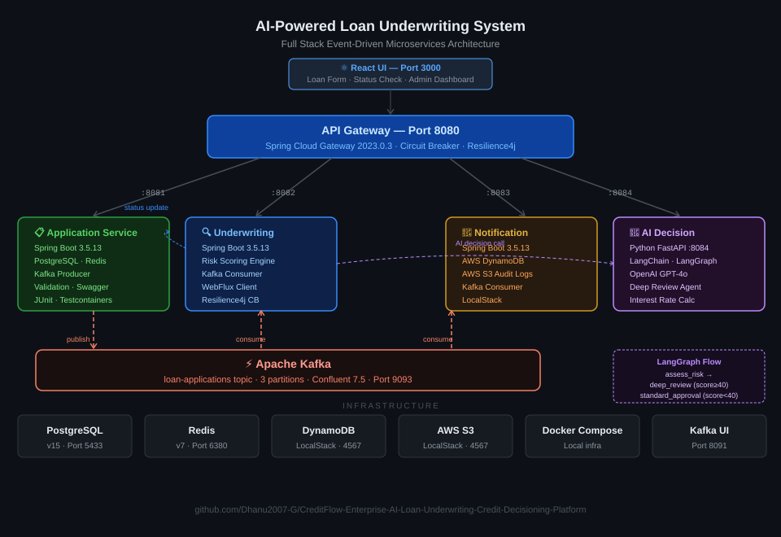
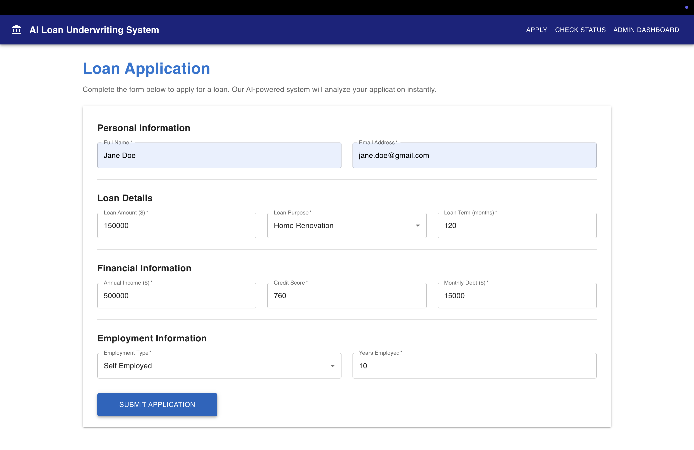
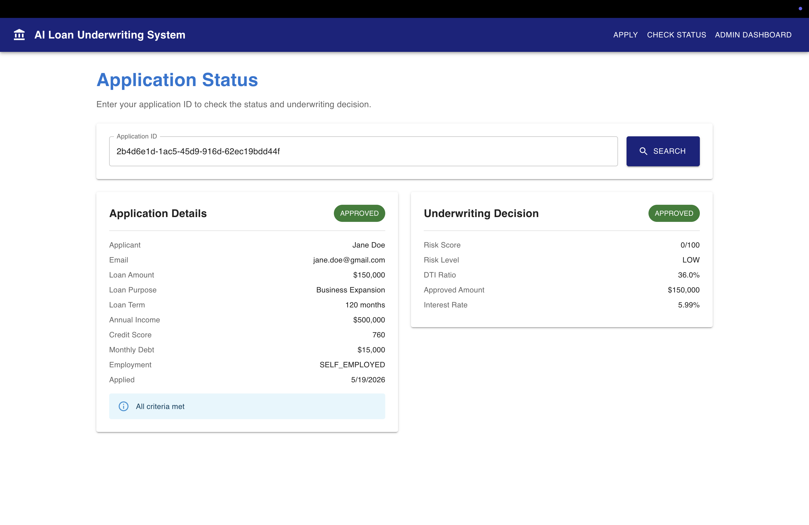
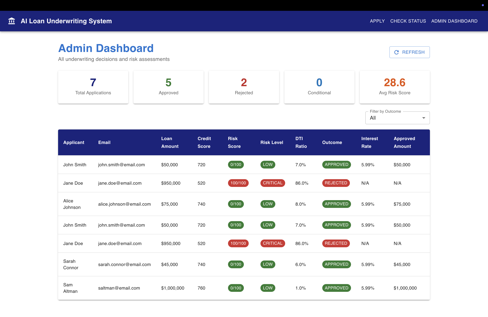

# CreditFlow: Enterprise AI Loan Underwriting & Credit Decisioning Platform

A production-grade, full stack event-driven microservices system for intelligent loan underwriting, powered by Java Spring Boot, Apache Kafka, React, and OpenAI GPT-4o with LangChain/LangGraph agentic reasoning.



---

## 📸 Screenshots

### Loan Application Form


### Application Status & Underwriting Decision


### Admin Dashboard


---

## 🛠 Tech Stack

| Layer | Technology |
|---|---|
| **Frontend** | React 18, Material UI v5, Axios, React Router |
| **API Gateway** | Spring Cloud Gateway 2023.0.3, Resilience4j Circuit Breaker |
| **Backend Services** | Java 17, Spring Boot 3.5.13, Spring Data JPA, WebFlux, Maven |
| **AI / LLM** | Python 3.10, FastAPI, LangChain, LangGraph, OpenAI GPT-4o |
| **Messaging** | Apache Kafka 3.9 (Confluent), Zookeeper |
| **Databases** | PostgreSQL 15 (transactional), Redis 7 (caching) |
| **Cloud Storage** | AWS DynamoDB (notifications), AWS S3 (audit logs) via LocalStack |
| **Infrastructure** | Docker, Docker Compose, LocalStack 3.0 |
| **Documentation** | SpringDoc OpenAPI / Swagger UI |
| **Testing** | JUnit 5, Mockito, Testcontainers, MockMvc |
| **Observability** | Spring Boot Actuator, Micrometer, Structured Logging |

---

## 🚀 Services

### 1. React UI — Port 3000
Full stack React frontend with three screens:
- **Loan Application Form** — submit new applications with full validation
- **Application Status** — check real-time status and underwriting decision by ID
- **Admin Dashboard** — view all decisions with risk scores, DTI ratios, outcomes and interest rates

### 2. API Gateway — Port 8080
Single entry point routing all client and UI requests to downstream services with circuit breaker protection.

### 3. Application Service — Port 8081
Accepts loan applications via REST, validates, persists to PostgreSQL, caches in Redis, and publishes events to Kafka.

**Endpoints:**
```
POST   /api/v1/loans                       Submit new loan application
GET    /api/v1/loans/{id}                  Get application by ID
GET    /api/v1/loans/email/{email}         Get applications by email
GET    /api/v1/loans/status/{status}       Get applications by status
PATCH  /api/v1/loans/{id}/status           Update application status
```

### 4. Underwriting Service — Port 8082
Consumes Kafka events, runs rule-based risk scoring engine, saves decisions to PostgreSQL, calls AI service for enhanced analysis, and updates application status.

**Risk Scoring Rules:**
- Credit score < 580 → +35 score
- Credit score < 650 → +15 score
- DTI ratio > 43% → +30 score
- DTI ratio > 36% → +10 score
- Loan/income ratio > 5x → +25 score
- Self-employed < 2 years → +20 score
- Annual income < $20,000 → +20 score

**Risk Levels:** `LOW` (0–19) | `MEDIUM` (20–39) | `HIGH` (40–69) | `CRITICAL` (70+)

**Outcomes:** `APPROVED` | `CONDITIONAL_APPROVAL` | `REJECTED`

**Interest Rates:** LOW → 5.99% | MEDIUM/HIGH → 8.99%/12.99% | CRITICAL → Rejected

**Endpoints:**
```
GET  /api/v1/underwriting/decisions                      All decisions
GET  /api/v1/underwriting/decisions/application/{id}     Decision by application ID
GET  /api/v1/underwriting/decisions/risk/{level}         Decisions by risk level
GET  /api/v1/underwriting/decisions/outcome/{outcome}    Decisions by outcome
```

### 5. Notification Service — Port 8083
Consumes Kafka events, stores notifications in DynamoDB, archives audit logs to S3 with date-partitioned keys.

**Endpoints:**
```
GET  /api/v1/notifications                          All notifications
GET  /api/v1/notifications/application/{id}         Notifications by application ID
```

### 6. AI Decision Service — Port 8084
Python FastAPI service with two AI analysis modes powered by OpenAI GPT-4o.

**Simple Analysis** — single LangChain LLM call for credit decision.

**Agentic Analysis** — LangGraph stateful multi-step reasoning:
```
assess_risk node
    ├── score ≥ 40 or credit < 620  →  deep_review node    (HIGH/CRITICAL → REJECT/CONDITIONAL)
    └── score < 40                  →  standard_approval node (LOW/MEDIUM  → APPROVE)
```

**AI Output includes:**
- Decision (APPROVE / REJECT / CONDITIONAL_APPROVAL)
- Detailed explanation
- Suggested interest rate
- Approved loan amount
- Step-by-step reasoning

**Endpoints:**
```
POST  /api/v1/ai/analyze         Simple LangChain analysis
POST  /api/v1/ai/analyze/agent   LangGraph agentic analysis
GET   /health                    Health check
```

---

## 📋 Prerequisites

- Java 17+
- Maven 3.8+
- Python 3.10+
- Node.js 18+
- Docker Desktop
- OpenAI API key with active credits

---

## ⚡ Quick Start

### 1. Clone the repository
```bash
git clone https://github.com/Dhanu2007-G/CreditFlow-Enterprise-AI-Loan-Underwriting-Credit-Decisioning-Platform.git
cd CreditFlow-Enterprise-AI-Loan-Underwriting-Credit-Decisioning-Platform
```

### 2. Start infrastructure
```bash
docker compose up -d
```

### 3. Set up AI service
```bash
cd ai-decision-service
python3 -m venv venv
source venv/bin/activate
pip install -r requirements.txt
cp .env.example .env
# Edit .env and add your OpenAI API key: OPENAI_API_KEY=sk-...
```

### 4. Start all services (in separate terminals)
```bash
# Terminal 1 — Application Service
cd application-service && mvn spring-boot:run

# Terminal 2 — Underwriting Service
cd underwriting-service && mvn spring-boot:run

# Terminal 3 — Notification Service
cd notification-service && mvn spring-boot:run

# Terminal 4 — AI Decision Service
cd ai-decision-service && source venv/bin/activate && python main.py

# Terminal 5 — API Gateway
cd api-gateway && mvn spring-boot:run

# Terminal 6 — React UI
cd react-ui && npm start
```

---

## 🔌 Ports & URLs

| Service | Port | URL |
|---|---|---|
| React UI | 3000 | http://localhost:3000 |
| API Gateway | 8080 | http://localhost:8080 |
| Application Service | 8081 | http://localhost:8081/swagger-ui.html |
| Underwriting Service | 8082 | http://localhost:8082/swagger-ui.html |
| Notification Service | 8083 | http://localhost:8083/swagger-ui.html |
| AI Decision Service | 8084 | http://localhost:8084/docs |
| Kafka UI | 8091 | http://localhost:8091 |
| LocalStack (DynamoDB/S3) | 4567 | http://localhost:4567 |

---

## 🧪 End-to-End Test Flow

### Step 1 — Submit a normal loan application
```bash
curl -X POST http://localhost:8080/api/v1/loans \
  -H "Content-Type: application/json" \
  -d '{
    "applicantName": "John Smith",
    "email": "john.smith@email.com",
    "loanAmount": 50000.00,
    "loanPurpose": "Home Renovation",
    "loanTermMonths": 60,
    "annualIncome": 85000.00,
    "creditScore": 720,
    "monthlyDebt": 500.00,
    "employmentType": "FULL_TIME",
    "employmentYears": 5
  }'
```

### Step 2 — Submit a high-risk application
```bash
curl -X POST http://localhost:8080/api/v1/loans \
  -H "Content-Type: application/json" \
  -d '{
    "applicantName": "Jane Doe",
    "email": "jane.doe@email.com",
    "loanAmount": 950000.00,
    "loanPurpose": "Business Expansion",
    "loanTermMonths": 360,
    "annualIncome": 35000.00,
    "creditScore": 520,
    "monthlyDebt": 2500.00,
    "employmentType": "SELF_EMPLOYED",
    "employmentYears": 1
  }'
```

### Step 3 — Check underwriting decisions
```bash
curl http://localhost:8080/api/v1/underwriting/decisions
curl http://localhost:8080/api/v1/underwriting/decisions/outcome/REJECTED
```

### Step 4 — AI agentic analysis
```bash
curl -X POST http://localhost:8080/api/v1/ai/analyze/agent \
  -H "Content-Type: application/json" \
  -d '{
    "application_id": "your-application-id",
    "applicant_name": "Jane Doe",
    "loan_amount": 950000.00,
    "loan_purpose": "Business Expansion",
    "loan_term_months": 360,
    "annual_income": 35000.00,
    "credit_score": 520,
    "monthly_debt": 2500.00,
    "employment_type": "SELF_EMPLOYED",
    "employment_years": 1,
    "risk_score": 100.0,
    "risk_level": "CRITICAL",
    "risk_reasons": [
      "Credit score below minimum threshold of 580",
      "Debt-to-income ratio exceeds maximum of 43%",
      "Loan amount extremely high relative to income",
      "Self-employed with less than 2 years history"
    ]
  }'
```

**Expected AI Response:**
```json
{
  "decision": "REJECT",
  "confidence": 0.95,
  "explanation": "Multiple critical risk factors identified...",
  "recommended_action": "Advise applicant to improve credit and reapply",
  "suggested_interest_rate": 0.0,
  "approved_amount": 0.0,
  "reasoning_steps": [
    "Initial assessment: credit_score=520, risk_score=100.0, level=CRITICAL",
    "Escalating to deep credit review — elevated risk detected",
    "Deep review decision: REJECT"
  ]
}
```

---

## 🏗 Infrastructure

| Container | Image | Port |
|---|---|---|
| PostgreSQL | postgres:15-alpine | 5433 |
| Redis | redis:7-alpine | 6380 |
| Zookeeper | confluentinc/cp-zookeeper:7.5.0 | 2182 |
| Kafka | confluentinc/cp-kafka:7.5.0 | 9093 |
| Kafka UI | provectuslabs/kafka-ui:latest | 8091 |
| LocalStack | localstack/localstack:3.0 | 4567 |

---

## 📁 Project Structure

```
loan-underwriting-system/
├── api-gateway/                    Spring Cloud Gateway (port 8080)
├── application-service/            Loan REST API + Kafka producer (port 8081)
│   └── src/main/java/
│       ├── controller/
│       ├── service/
│       ├── repository/
│       ├── kafka/
│       ├── model/
│       ├── dto/
│       ├── config/
│       └── exception/
├── underwriting-service/           Kafka consumer + risk engine (port 8082)
│   └── src/main/java/
│       ├── service/
│       │   ├── UnderwritingService.java
│       │   └── RiskScoringEngine.java
│       ├── client/ApplicationServiceClient.java
│       └── kafka/LoanApplicationConsumer.java
├── notification-service/           DynamoDB + S3 notifications (port 8083)
├── ai-decision-service/            Python FastAPI + LangChain + LangGraph (port 8084)
│   ├── app/
│   │   ├── config/settings.py
│   │   ├── models/schemas.py
│   │   ├── routes/decision_routes.py
│   │   └── services/
│   │       ├── loan_analyzer.py    LangChain simple analysis
│   │       └── loan_agent.py       LangGraph agentic analysis
│   ├── main.py
│   ├── requirements.txt
│   └── .env.example
├── react-ui/                       React 18 + Material UI frontend (port 3000)
│   └── src/
│       ├── pages/
│       │   ├── LoanApplicationForm.js
│       │   ├── ApplicationStatus.js
│       │   └── AdminDashboard.js
│       └── services/api.js
├── docker-compose.yml
└── README.md
```

---

## ☁️ AWS Deployment (Planned)

Designed for production AWS deployment via CDK:

| AWS Service | Purpose |
|---|---|
| ECS Fargate | Containerized microservices |
| MSK | Managed Kafka |
| Aurora PostgreSQL | Managed relational DB |
| ElastiCache Redis | Managed caching |
| DynamoDB | Notification storage |
| S3 | Audit log archival |
| CloudFront + S3 | React UI hosting |
| Cognito | Authentication |
| API Gateway | Managed gateway |

---

## 👤 Author

**Dhanwanth Jangam**
Backend & Cloud Engineer | Java · Spring Boot · Kafka · AWS · Python · React · AI

- 💼 GitHub: [github.com/Dhanu2007-G](https://github.com/Dhanu2007-G)
